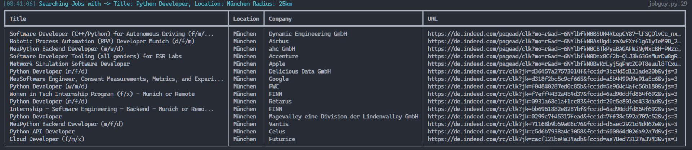

# JobGuy
<p align="center">
<br/>
<a href="https://www.python.org/"></a>
<a href="https://pypi.python.org/pypi/ansicolortags//"></a>
<a href="https://github.com/psf/black"></a>
<a href="https://www.python.org/dev/peps/pep-0008/"></a>
</p>


<hr>

**Automated tool for scraping job postings from different Job portals**

<br/>

### Benefits over job search sites and other scrapers:

* Simple and lightweight with minimal dependencies.
* No duplicate listings!
* No advertising.
* No API Keys needed.
* See jobs from multiple job search websites all in one place.
* Use tagging powered search.
* Export Jobs to multiple file formats like `.xlsx` and `.csv` or just use your terminal.

### Planned Features 
* Telegram Notifications for new Jobs
* Flask powered Web interface

# Installation
_JobGuy requires Python 3.8 or later._

This project uses pipenv as environment manager. To install pipenv:

```markdown
pip install pipenv
```
After successful installation just install all needed packages:
```markdown
pipenv install
```

# Usage
Want to find data science jobs near Berlin?

    python jobguy.py -d DataScientist -l Berlin

It's as easy as it gets!

To see all possible options just run: 

    python jobguy.py --help

    Options:
    -d, --desc TEXT         job description
    -l, --loc TEXT          job location
    -r, --rad INTEGER       radius in km
    -n, --max_nums INTEGER  number of jobs to gather
    -o, --output TEXT       output filename (.csv|.xlsx)
    -t, --tags TEXT         tags like cpp or python
    --help                  Show this message and exit.
    


