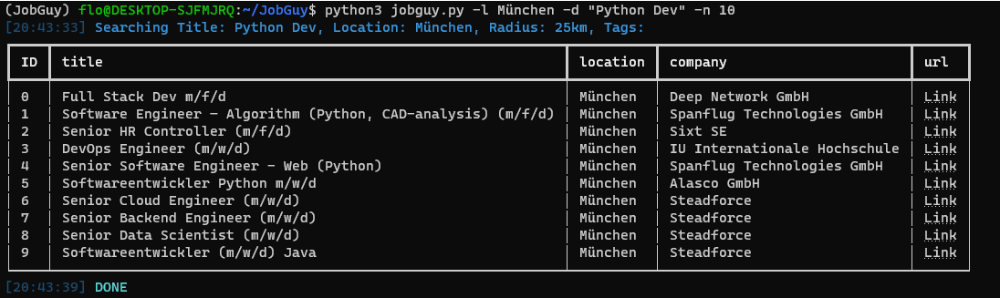

# JobGuy
<p align="center">
<br/>
<a href="https://www.python.org/"></a>
<a href="https://pypi.python.org/pypi/ansicolortags//"></a>
<a href="https://github.com/psf/black"></a>
<a href="https://www.python.org/dev/peps/pep-0008/"></a>
</p>


<hr>

**Automated tool for scraping job postings from different Job portals**

<br/>

### Benefits over job search sites:

* Never see the same job twice!
* No advertising.
* See jobs from multiple job search websites all in one place.
* Use Tagging powered Search.
* Export Jobs to multiple file formats like `sqlite`, `Excel` and `CSV`.
* No API keys needed!

### Planned Features 
* Telegram Notifications for new Jobs
* Flask powered Web interface

# Installation
_JobGuy requires 3.8 or later._

This project uses pipenv as environment manager. To install pipenv:

```markdown
pip install pipenv
```
After successful installation just install all needed packages to a isolated environment:

```markdown
pipenv install
```

# Usage

## Configuration

## Scraping

